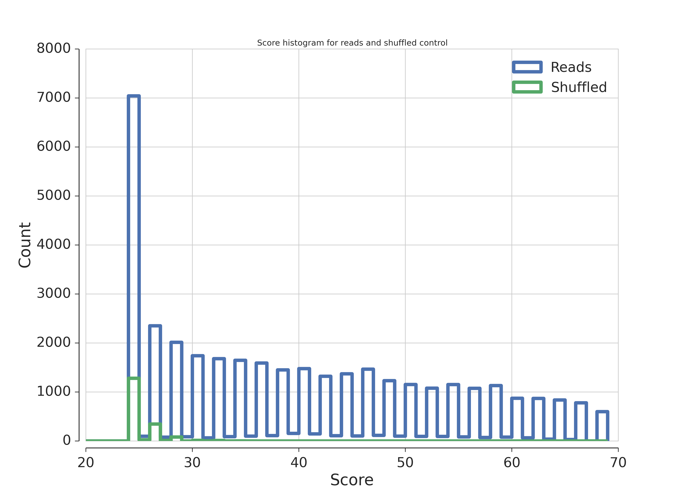
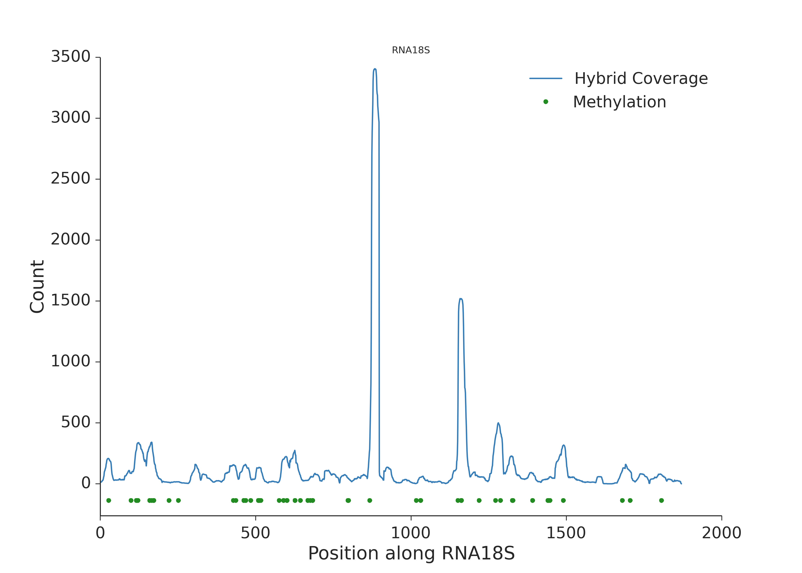
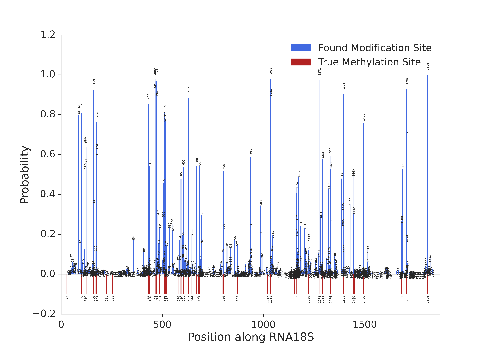
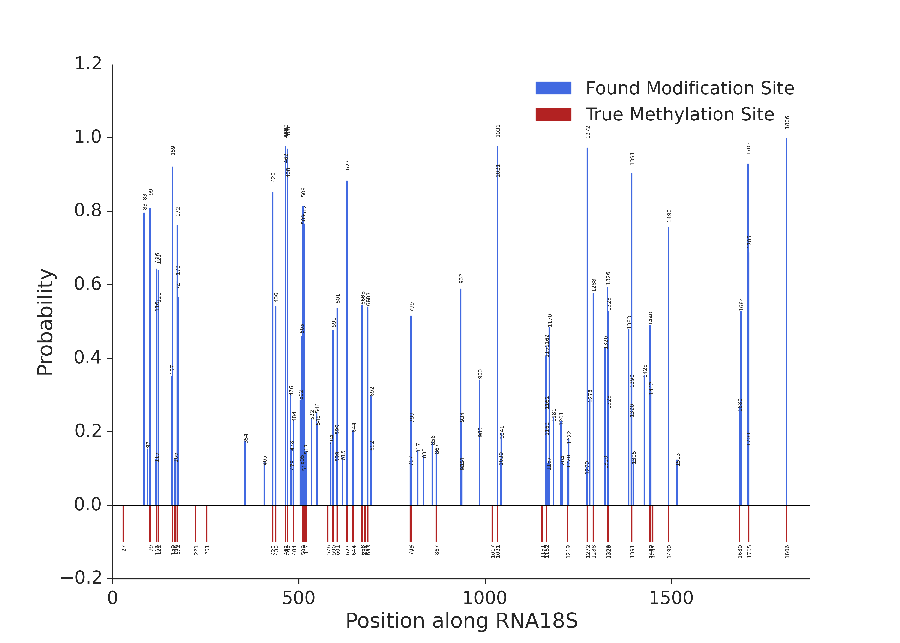
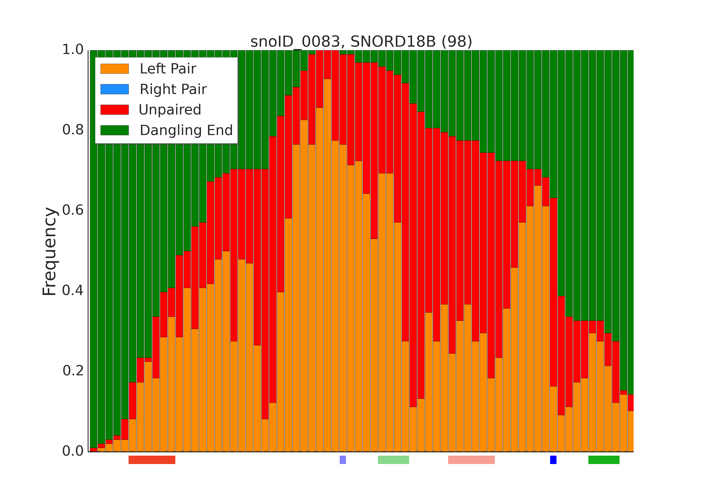

Results
*******

Results of the pipeline are presented in the form of table. Additionally
the pipeline generates plots that can be used to immediate inspection of the
results. The pipeline during run generates many files. You can check the files
generated at each step in the :ref:`pipeline-flow` section.

The file with results is called test/results_with_probability_annotated.tab.
This is an example of the table generated by the run of test::
    RNA18S	1805	1806	snoID_0145	35.0	+	-32.5	-2.362136710375476	T	((((((((((((((((((((.&))))))))))))))))))))	0.9985874938860818	1806	NA	NA	NA	NA	NA
    RNA28S	3722	3723	snoID_0051	297.0	+	-24.5	-0.8262461258511468	G	.((((((((((((((((.&.)))))))))))))))).	0.9820269187646468	3723	NA	NA	NA	NA	NA
    RNA18S	461	462	snoID_0091	10.0	+	-26.6	-2.0974042420540084	C	((((((((((((((.((.&.)).))))))))))))))	0.9769660814617612	462	NA	NA	NA	NA	NA
    RNA18S	1030	1031	snoID_0038	15.0	+	-24.6	-1.5332765514685365	A	(((((((((((((((((.&.)))))))))))))))))	0.9764776374727128	1031	NA	NA	NA	NA	NA
    RNA28S	390	391	snoID_0128	638.0	+	-22.6	-0.4628266825472744	A	.(((((((((((((.&.))))))))))))).	0.9730740226153078	391	NA	NA	NA	NA	NA
    RNA18S	1271	1272	snoID_0080	24.0	+	-26.5	-3.0061575391125657	C	.((((((((((((.&.)))))))))))).	0.9729293415188028	1272	NA	NA	NA	NA	NA
    RNA18S	467	468	snoID_0114	6.0	+	-25.5	-3.9820153772481808	A	(((((((((((((((.&.)))))))))))))))	0.970629236316464	468	NA	NA	NA	NA	NA
    RNA18S	461	462	snoID_0064	11.0	+	-25.7	-2.040235979926924	C	((((((((((((((.&.))))))))))))))	0.9680243404065784	462	NA	NA	NA	NA	NA
    RNA18S	461	462	snoID_0094	18.0	+	-25.7	-2.316104404986292	C	((((((((((((((.&.))))))))))))))	0.9680243404065784	462	NA	NA	NA	NA	NA
    RNA18S	461	462	snoID_0124	1.0	+	-25.6	-2.2282206777051834	C	((((((((((((((.&.))))))))))))))	0.9668440616572168	462	NA	NA	NA	NA	NA

Columns:

+---------------+-----------------------------------------+
| Column Number | Description                             |
+===============+=========================================+
| 1             | Chromosome                              |
+---------------+-----------------------------------------+
| 2             | Start (0-based)                         |
+---------------+-----------------------------------------+
| 3             | End (1-based)                           |
+---------------+-----------------------------------------+
| 4             | snoRNA ID                               |
+---------------+-----------------------------------------+
| 5             | Chmieras count                          |
+---------------+-----------------------------------------+
| 6             | Strand                                  |
+---------------+-----------------------------------------+
| 7             | Interaction energy (PLEXY)              |
+---------------+-----------------------------------------+
| 8             | Log site specificity                    |
+---------------+-----------------------------------------+
| 9             | Modified nucleotide                     |
+---------------+-----------------------------------------+
| 10            | Interaction structure (PLEXY)           |
+---------------+-----------------------------------------+
| 11            | Interaction probability from the model  |
+---------------+-----------------------------------------+
| 12            | Modification position (1-based)         |
+---------------+-----------------------------------------+
| 13            | Genecode gene type eg. protein_coding   |
+---------------+-----------------------------------------+
| 14            | ENSEMBL ID                              |
+---------------+-----------------------------------------+
| 15            | Gene name                               |
+---------------+-----------------------------------------+
| 16            | Transcrip region eg. intron             |
+---------------+-----------------------------------------+
| 17            | mRNA region eg. five_prime_UTR          |
+---------------+-----------------------------------------+

.. note::
    Log site specificity feature is not used to calculate probability. It is
    calculated ad a ratio between number of chimeric reads for specific positions
    and snoRNA with total number of chimeric reads for particular position.

Inspection of a run
*******************

In order to quick inspect the run use plots produced by the pipeline.

Score histogram
---------------

   The distribution of the local alignment scores of unmapped reads to snoRNAs
   (blue) and the same reads shuffled using ushuffle (green).

As can bee seen in the figure scores for unshuffled reads are way highter than
for shuffled ones. This indicates the enrichment of snoRNAs in reads.

Read profiles
-------------

One can also check the profile of the split chimeras that map to particular target
RNA along its sequence.

   Profile (nucleotide count) along 18S rRNA. Green dots represent 2'-O-methylations
   known from previous studies.

In order to see previous 2'-O-methylation positions they should be declared in the
snoRNA table.

It can be seen that the spots with known modifications are covered by more chimeric
reads.

Probabilities
-------------

Another important plot produced by the pipeline are the probabilities derived
from model ploted for each nucleotide in the target RNA.

   Probability calculated by the model along 18S rRNA. Red bars represent 2'-O-methylations
   known from previous studies.

    The same plot as previousely but with probabilities shown only for the positions
    on which the probability is higher than 0.1 (for clarity).

It can be immediately seen that the positions with knwon modification sites have
higher probability values. Which indicates that the experiment is working as expected.

RNAduplex
---------

RNAduplex part of the pipeline also produces its own results table. This can be used
to investigate non-canonical interactions. The table is called results_with_RNAduplex_score_annotated.tab::

    RNA18S	103	153	snoID_0159	1	+	0.0	NaN	NaN	NaN	NaN	0.0	82	0.426829268293	-28.20	-15.50	-24.10	######################.((((((....((((((((((((((....(((((((..............(((((.####	23,78	1,48	###############.(((((.(((.(((.(((((((((....(((...............((((.(((((.###	NA	NA	NA	NA	NA
    RNA18S	141	191	snoID_0159	1	+	-9.6	.(((((((((.&.))))))))).	GGTAAmTTCTAG&ATAGGATTACG	D	159	-8.9	82	0.426829268293	-20.60	-20.20	-22.10	##########################.((((......(((.(((..(((........((((..(((((((((((.....((.	27,82	3,45	#########################.(((((((((((((((((.((((...(((	NA	NA	NA	NA	NA
    RNA18S	288	338	snoID_0159	1	+	0.0	NaN	NaN	NaN	NaN	0.0	82	0.426829268293	-21.20	-27.90	-22.90	#######################.(((((((..(.(.((((...............(((.......((((...((((((.##	24,80	14,50	################.((....(((((((.................((..(((..(((....((((((.((.##	NA	NA	NA	NA	NA
    RNA18S	1243	1293	snoID_0159	1	+	0.0	NaN	NaN	NaN	NaN	-4.8	82	0.426829268293	-22.20	-13.90	-24.40	#.((((((........(((.....(((((.(....(.(((((.......................((....((.((((.###	2,79	3,50	################################################################.(((((...((((..(((.(((.(((.##	NA	NA	NA	NA	NA
    RNA18S	1255	1305	snoID_0159	1	+	0.0	NaN	NaN	NaN	NaN	-1.6	82	0.426829268293	-21.40	-20.10	-18.70	#.((((((..((.((.(((.....(((((.(....(.(((((.(.#####################################	2,45	5,46	#####################.(((.(((.((((...((.((.....((.(((((.........((((((((.	NA	NA	NA	NA	NA

Columns:

+---------------+----------------------------------------------------------------+
| Column Number | Description                                                    |
+===============+================================================================+
| 1             | Chromosome                                                     |
+---------------+----------------------------------------------------------------+
| 2             | Start (0-based)                                                |
+---------------+----------------------------------------------------------------+
| 3             | End (1-based)                                                  |
+---------------+----------------------------------------------------------------+
| 4             | snoRNA ID                                                      |
+---------------+----------------------------------------------------------------+
| 5             | Chimera count                                                  |
+---------------+----------------------------------------------------------------+
| 6             | Strand                                                         |
+---------------+----------------------------------------------------------------+
| 7             | Interaction energy (PLEXY)                                     |
+---------------+----------------------------------------------------------------+
| 8             | Interaction structure (PLEXY)                                  |
+---------------+----------------------------------------------------------------+
| 9             | Interaction sequence (PLEXY)                                   |
+---------------+----------------------------------------------------------------+
| 10            | Box                                                            |
+---------------+----------------------------------------------------------------+
| 11            | Modification position (1-based)                                |
+---------------+----------------------------------------------------------------+
| 12            | Interaction energy with random snoRNA (PLEXY)                  |
+---------------+----------------------------------------------------------------+
| 13            | snoRNA sequence length                                         |
+---------------+----------------------------------------------------------------+
| 14            | GC fraction in snoRNA seuqnce                                  |
+---------------+----------------------------------------------------------------+
| 15            | Interaction energy (RNAduplex)                                 |
+---------------+----------------------------------------------------------------+
| 16            | Interaction energy with random snoRNA (RNAduplex)              |
+---------------+----------------------------------------------------------------+
| 17            | Interaction energy with shuffled target sequence (RNAduplex)   |
+---------------+----------------------------------------------------------------+
| 18            | Structure along snoRNA (RNAduplex)                             |
+---------------+----------------------------------------------------------------+
| 19            | snoRNA positions (RNAduplex)                                   |
+---------------+----------------------------------------------------------------+
| 20            | Target positions (RNAduplex)                                   |
+---------------+----------------------------------------------------------------+
| 21            | Genecode gene type eg. protein_coding                          |
+---------------+----------------------------------------------------------------+
| 22            | ENSEMBL ID                                                     |
+---------------+----------------------------------------------------------------+
| 23            | Gene name                                                      |
+---------------+----------------------------------------------------------------+
| 24            | Transcrip region eg. intron                                    |
+---------------+----------------------------------------------------------------+
| 25            | mRNA region eg. five_prime_UTR                                 |
+---------------+----------------------------------------------------------------+

RNAduplex is used as an alternative to PLEXY which is not bound to the specific
snoRNA-target interaction. This part of the pipeline is used to generate
a profile of bound/unbound positions along given snoRNA based on the column 18
(Structure along snoRNA) of the clustered RNAduplex results. One can view these plots
as an aggregation of RNAduplex-calculated structures for each snoRNA-target chimeric
pairs.

    Fraction of structures in which given position was bound/unbound to the target
    along snoRNA calculated by RNAduplex.
